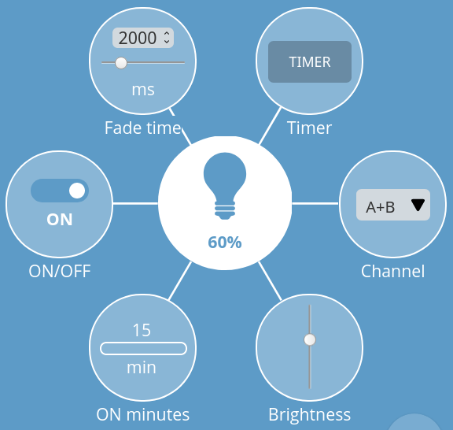
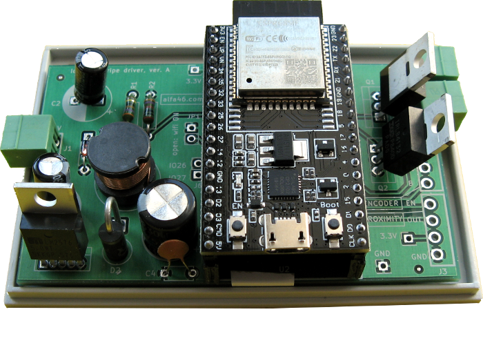

# webThing LED lighting controller with 2 channels

22th January 2020

## Introduction

This WebThing controller is prepared for ESP32 CPUs and uses esp-idf environment (current stable version).

The WebThing controls two LED light sources with a LED_PWM controller with hardware fading functionality ("automatically increase or decrease the duty cycle gradually, allowing for fades without any processor
interference").

## Dependencies

Requires:

 * [web-thing-server](https://github.com/KrzysztofZurek1973/webthings-components/tree/master/web_thing_server) from ```webthings-components```

## Example

See [webthings-node-example-project](https://github.com/KrzysztofZurek1973/webthings-node-example-project) or [webthings-empty-project](https://github.com/KrzysztofZurek1973/webthings-empty-project).

## Features



WebThing has the following properties and one action:

 * ON/OFF
 * Channel, choose channel A, B or A+B
 * ON minutes, shows minutes when device was ON in the current day, it is cleared on midnight
 * brightness, in percentage 0 .. 100
 * fade time, the time of smooth change of light from one level to another in milliseconds
 * timer (action), turn ON the channel(s) for a certain number of minutes
 
 

## Documentation

See [webthings-empty-project](https://github.com/KrzysztofZurek1973/webthings-empty-project) and follow steps described in **Build webThing Device** chapter.

In point 5 download ```webthing-led-2-channels``` repository. In function ```init_things()``` call ```init_led_2_channels()``` and include ```webthing_led_2_channels.h``` in your main project file.

## Source Code

The source code is available from [GitHub](https://github.com/KrzysztofZurek1973/webthing-esp32-led-lighting-2-channels).

## Prototype

In the ```prototype``` folder there are schematic file and a photo of the working prototype device. This device is built with ESP32 DevKitC.



This prototype is prepared for 12V LED stripes with a maximum power of approx. 50W per channel.

## Links

* [WebThing Gateway](https://webthings.io/gateway/) - https://webthings.io/gateway/
* [Web Thing API](https://webthings.io/api/) - https://webthings.io/api/
* [esp-idf](https://github.com/espressif/esp-idf) - https://github.com/espressif/esp-idf

## License

This project is licensed under the MIT License.

## Authors

* **Krzysztof Zurek** - [github](https://github.com/KrzysztofZurek1973)


